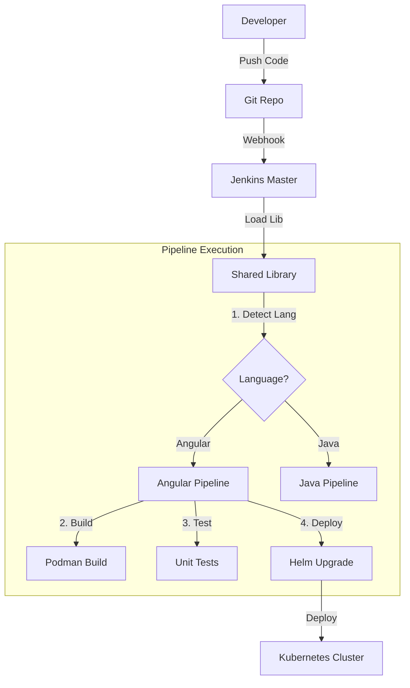

# System Architecture

The **Jenkins Pipelines Lab** is built on a modular architecture that separates configuration from logic.

## High-Level Design

The system follows a **Shared Library** pattern where the Jenkinsfile in the application repository is minimal, delegating all logic to the library.

## Core Components

### 1. The Orchestrator (`Main.groovy`)
The entry point for all pipelines. It:
- Validates the project structure.
- Loads external configurations.
- Instantiates the correct pipeline strategy (Strategy Pattern).

### 2. Dynamic Configuration
We avoid hardcoding values.
- **Nginx:** Uses `{{APP_NAME}}` placeholders replaced at build time.
- **Helm:** Values are injected via `--set` flags based on the branch and commit hash.

### 3. Garbage Collection (`Trash.groovy`)
An automated utility that keeps the build nodes clean.
- **Smart Clean:** Removes build artifacts (`dist/`, `node_modules/`) but keeps caches when possible.
- **Image Rotation:** Automatically removes old Docker/Podman images to prevent disk saturation.

## Decision Log

| Decision | Rationale |
| :--- | :--- |
| **Podman over Docker** | Security. Podman runs rootless and daemonless, reducing the attack surface on CI nodes. |
| **Helm Charts** | Standardization. A single "Generic Chart" is used for 90% of microservices, reducing maintenance. |
| **Groovy OOP** | Maintainability. Using Classes and Inheritance allows for cleaner code than standard procedural Jenkins scripts. |

[Back to Home](./)
